# Customer Account Inquiry System – CICS Online Application

This project demonstrates an end-to-end **CICS online customer inquiry transaction** built using **COBOL, CICS, BMS, VSAM and JCL**.

The application simulates a real-time banking style inquiry system where a user enters a Customer ID and customer details are retrieved from a VSAM KSDS file and displayed on a BMS screen.

---

## Transaction Start Screen

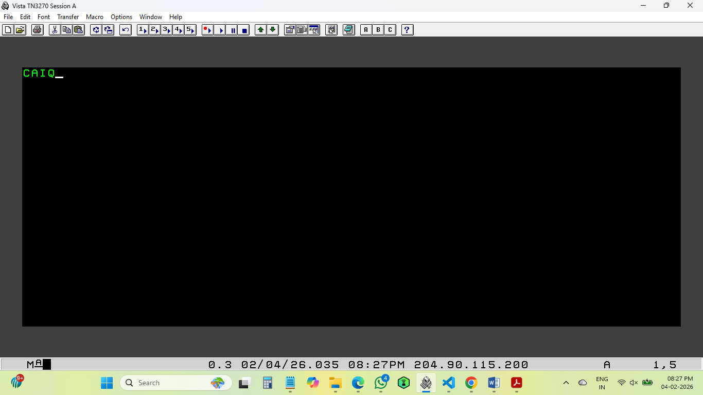

---

## Customer ID Not Found

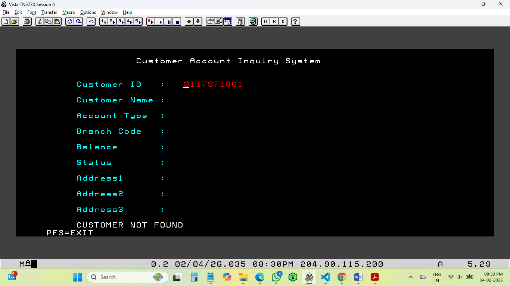

---

## Successful Customer Inquiry

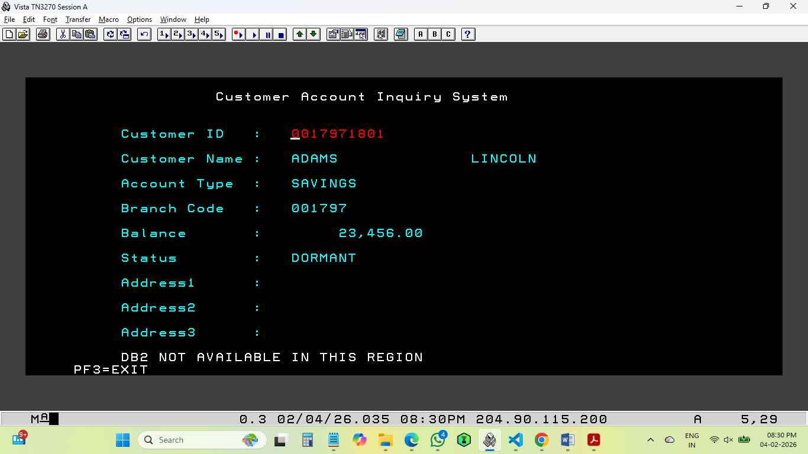

---

## CEDF Execution Flow

This shows the actual CICS command flow during transaction execution.

### RECEIVE MAP
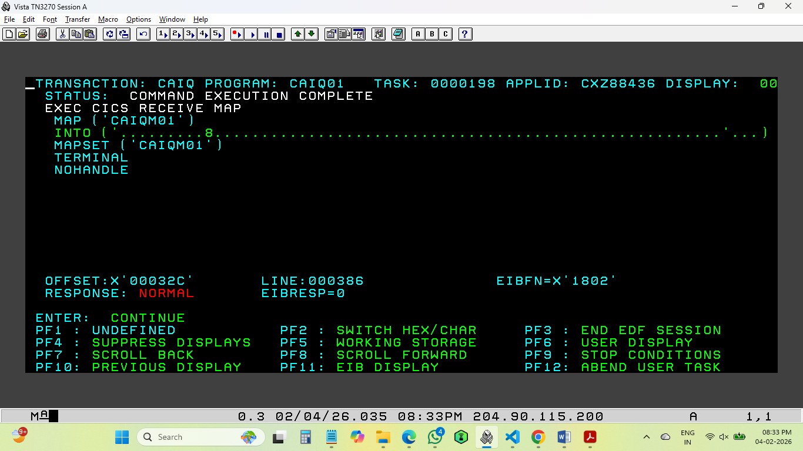

### READ VSAM FILE
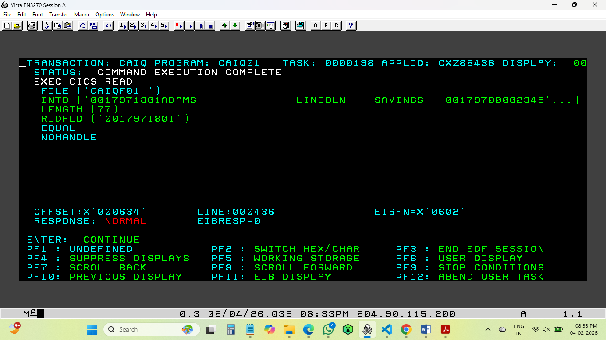

### SEND MAP
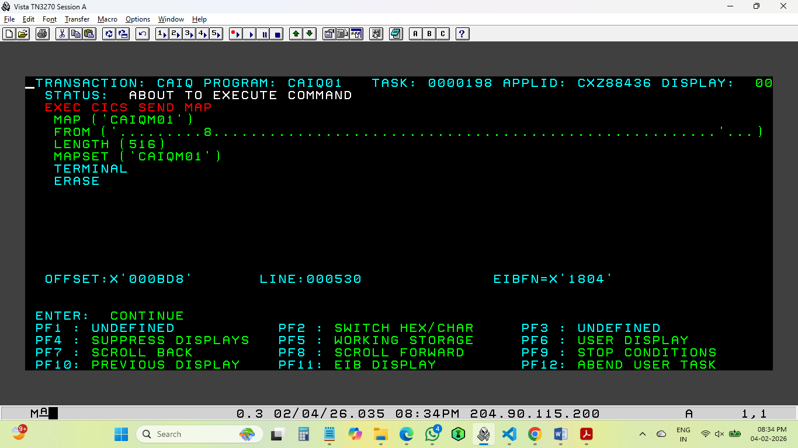

---

## CICS Resource Definitions Verified using CEMT

### Program Definition
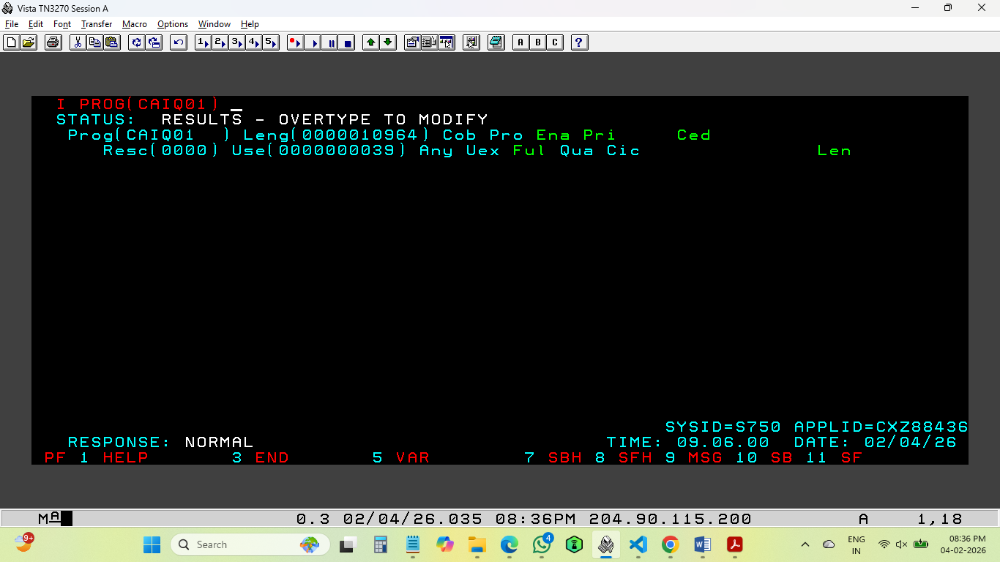

### File Definition
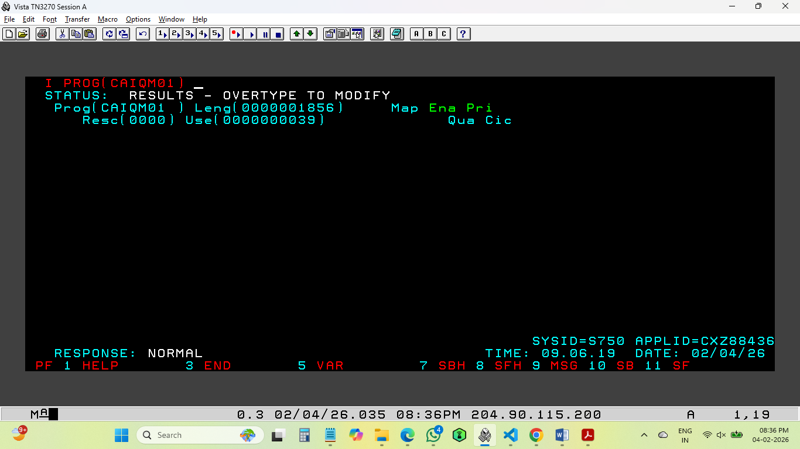

### Mapset Definition
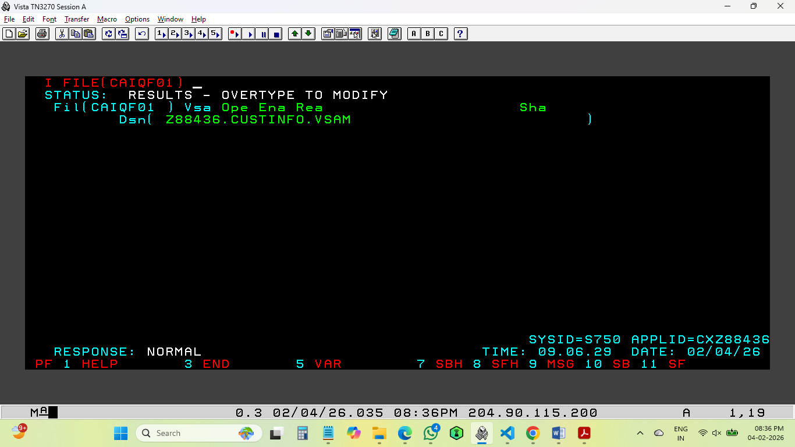

---

## VSAM Cluster Creation using IDCAMS (DEFINE CLUSTER)

### DEFINE – Part 1
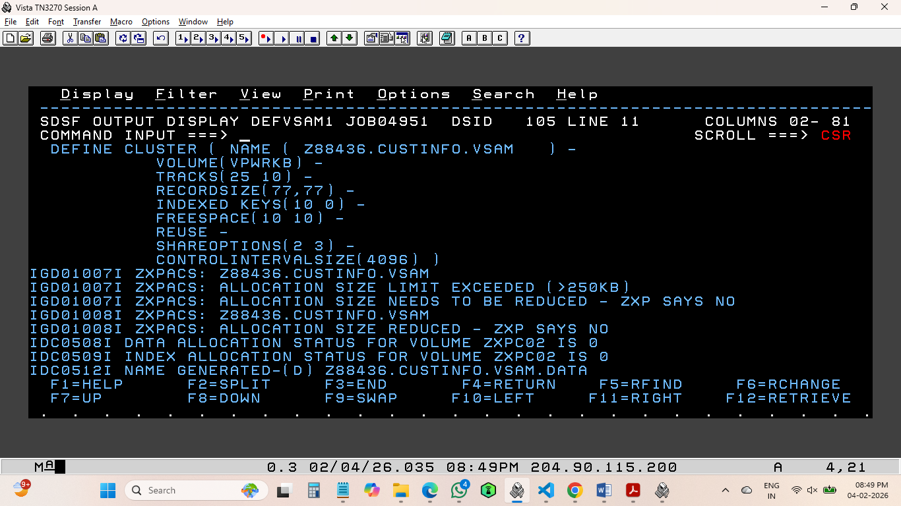

### DEFINE – Part 2
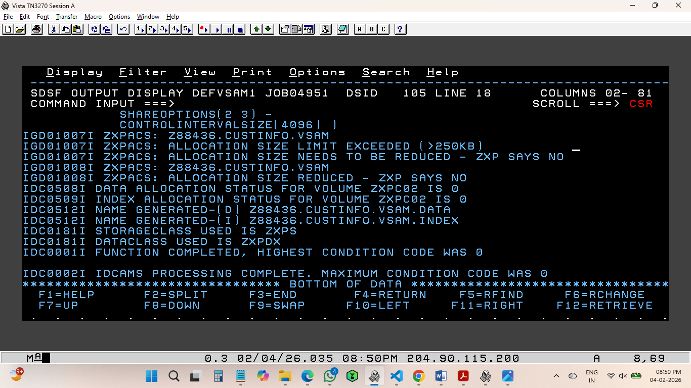

---

## VSAM Data Load using IDCAMS (REPRO)

### REPRO – Part 1
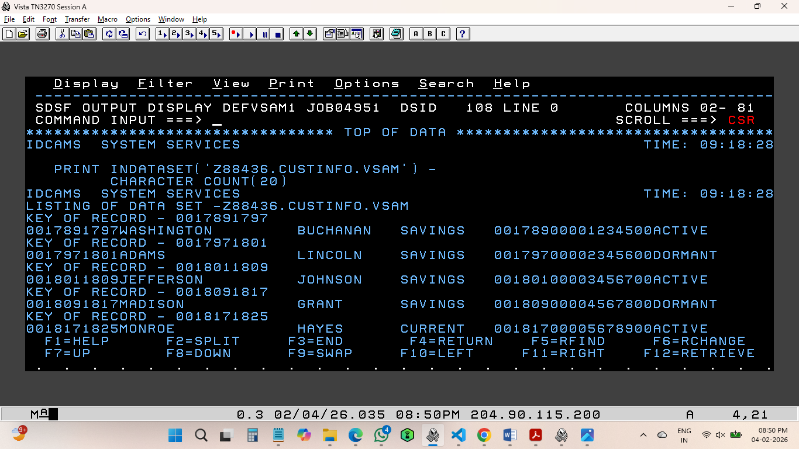

### REPRO – Part 2
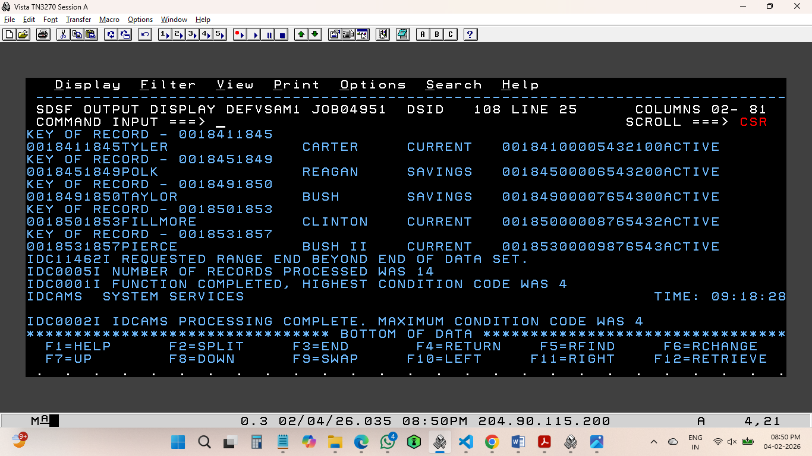

---

## Technologies Used

- COBOL
- CICS
- BMS Maps
- VSAM KSDS
- JCL
- IDCAMS
- CEDF Debugging
- CEMT Resource Definitions
